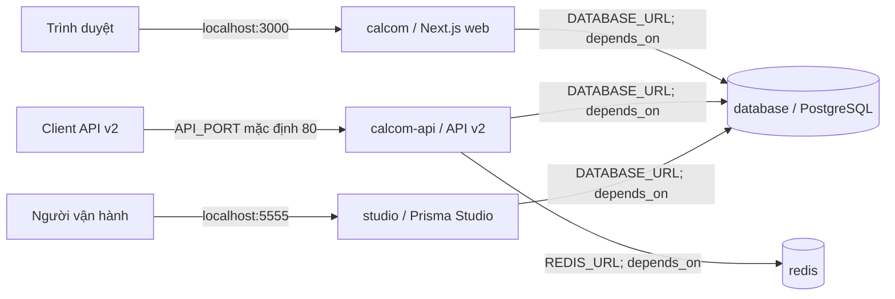
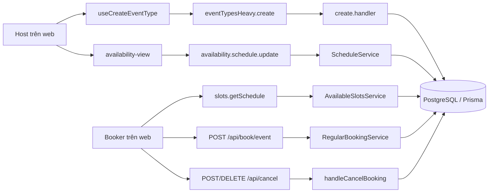

# Issue 01 — Cài đặt và kiến trúc kiểm thử vòng đời booking

Tài liệu cho R05 Cal.diy + K02 Model-Based Testing, chuẩn bị báo cáo giữa kỳ 20/10/2026. Các đường dẫn và luồng dưới đây đã đối chiếu với mã nguồn tại `7220e6f802c4d86b2c1cfb6f36835295628c71f0` (cha: `54343aa685ae8f33159d2f485ec4a57bad5c574a`). Trạng thái **chưa kiểm chứng** chỉ rõ phần cần chạy thử.

## 1. Mốc nguồn và phạm vi

- Upstream: <https://github.com/calcom/cal.diy>; fork: <https://github.com/BoyTay/cal.diy>.
- Nhánh tích hợp: `qa/model-based-booking`; commit điều chỉnh Docker: `7220e6f802`.
- Phạm vi: event type cá nhân, availability, đặt, đổi và hủy booking. Các nhánh thanh toán, recurring, team và tích hợp calendar ngoài chưa nằm trong kịch bản cơ bản.
- Luôn ghi `git rev-parse HEAD` trong bằng chứng chạy thử; một image kéo từ registry có thể khác mã nguồn của commit này.

## 2. Cài trên máy Windows mới

Cần Git, PowerShell, Docker Desktop với Linux containers và quyền kéo image. Các lệnh PowerShell dưới đây đã kiểm tra với PowerShell 7.6.5; **chưa kiểm tra với Windows PowerShell 5.1**. **Chưa kiểm chứng trên máy mới:** phiên bản Windows, RAM/đĩa tối thiểu và thời gian khởi động. Ghi `docker version` và `docker compose version` của máy kiểm thử, không áp một con số giả định.

```powershell
git clone https://github.com/BoyTay/cal.diy.git
Set-Location cal.diy
git switch qa/model-based-booking
git rev-parse HEAD
Copy-Item .env.example .env
```

Trong `.env` cục bộ, tạo giá trị ngẫu nhiên **riêng cho từng máy** cho `NEXTAUTH_SECRET`, `CALENDSO_ENCRYPTION_KEY` (32 ký tự theo hướng dẫn trong [README](../../README.md#running-caldiy-with-docker-compose)) và `JWT_SECRET` nếu chạy API v2. PowerShell 7.6.5 hỗ trợ `RandomNumberGenerator.GetBytes(int)`; đoạn sau ghi thẳng secret vào `.env` và **không in giá trị ra terminal**:

```powershell
function Set-LocalEnvSecret([string]$name, [int]$byteCount) {
    $value = [Convert]::ToBase64String(
        [Security.Cryptography.RandomNumberGenerator]::GetBytes($byteCount)
    )
    $lines = @(Get-Content -LiteralPath .env)
    $found = $false
    $lines = @($lines | ForEach-Object {
        if ($_ -match "^$([regex]::Escape($name))=") {
            $found = $true
            "$name=$value"
        } else {
            $_
        }
    })
    if (-not $found) { $lines += "$name=$value" }
    $lines | Set-Content -LiteralPath .env -Encoding utf8
}
Set-LocalEnvSecret NEXTAUTH_SECRET 32
Set-LocalEnvSecret CALENDSO_ENCRYPTION_KEY 24
Set-LocalEnvSecret JWT_SECRET 32
```

Base64 của 24 byte dài 32 ký tự. Nếu chỉ chạy biểu thức `[Convert]::ToBase64String(...)` trong PowerShell để sao chép thủ công, **secret sẽ hiển thị trong terminal và lịch sử cuộn**; tránh đưa ảnh chụp hoặc transcript đó vào báo cáo. Không sao chép secret từ máy khác.

**Đối chiếu cấu hình:** [Compose](../../docker-compose.yml) dùng `POSTGRES_USER`, `POSTGRES_PASSWORD`, `POSTGRES_DB`, `DATABASE_HOST` khi tạo URL cho web/API/Studio, trong khi các biến này không có trong `.env.example` tại commit đã chốt. Bổ sung chúng vào `.env` theo service `database` trong Compose (`DATABASE_HOST=database`, user/database/password phải khớp các giá trị hardcode hiện tại). Đặt `DATABASE_URL` và `DATABASE_DIRECT_URL` theo cùng URL nội bộ `postgresql://<user>:<password>@database:5432/<db>`. Các thông tin mặc định của Compose chỉ phù hợp máy kiểm thử cô lập; trước khi đưa stack ra mạng ngoài phải thay mật khẩu trong Compose **và** `.env` đồng bộ. `NEXT_PUBLIC_WEBAPP_URL`/`NEXTAUTH_URL` cần khớp địa chỉ web; API v2 dùng `API_PORT` (mặc định 80) và `REDIS_URL` theo mạng Compose. **Chưa kiểm chứng:** bộ giá trị `.env` tối thiểu cho lần cài sạch; không đưa file `.env` hay kết quả `docker compose config` vào báo cáo vì có thể chứa secret.

```powershell
docker version
docker compose version
docker compose up -d
docker compose ps
docker compose ps studio
docker compose logs --tail=80 calcom calcom-api studio
```

Mở `http://localhost:3000` cho web và `http://localhost:5555` cho Studio theo cổng trong Compose. Studio có quyền truy cập dữ liệu, chỉ bật trên máy kiểm thử tin cậy; có thể khởi động các service cần thiết mà không bật Studio bằng `docker compose up -d database redis calcom calcom-api`. Kiểm tra HTTP web và trạng thái service trước khi kết luận cài đặt thành công. Không sửa dữ liệu bằng Studio trong lúc thu bằng chứng. `docker compose down` dừng stack và giữ volume; **không dùng `down -v`** khi cần giữ dữ liệu thử nghiệm.

Ngày 05/10/2026, `docker compose ps` cho thấy `calcom-api`, `database`, `redis` running; `calcom` và `studio` running/healthy. Docker client 29.4.1 và Compose v5.1.3. Metadata của container cho thấy chúng được tạo từ checkout `.../Software Testing/Ex/cal.diy`, **không phải checkout Scheduling của tài liệu này**. Vì thế đây chỉ là bằng chứng môi trường đã có stack hoạt động, không xác nhận lệnh dựng từ máy mới hoặc HTTP/booking flow trên nhánh Issue 01. Compose cũng cảnh báo nhiều biến tùy chọn đang để trống.

Ở lần rà soát trước trên **đúng checkout PR** tại `fdac3b85c1ea9de47eb8bcfccae26b0908836263`, `docker compose -p caldiy-issue01 config --services` liệt kê năm service nhưng `ps` không liệt kê container nào. Kết quả này chỉ mô tả trạng thái trước lần chạy mới ở mục 6.

## 3. Sơ đồ container/component

Sơ đồ này dựa vào [docker-compose.yml](../../docker-compose.yml): các cạnh `depends_on`, biến kết nối và cổng công bố. Nó mô tả cấu hình triển khai; chưa chứng minh request booking thực tế đi qua API v2 hay Redis.



`calcom` dùng [Dockerfile](../../Dockerfile), `calcom-api` dùng [Dockerfile API v2](../../apps/api/v2/Dockerfile); `database` và `redis` dùng image theo Compose, còn `studio` dùng image Cal.diy với lệnh Prisma Studio. Tất cả ở mạng `stack`; cổng Redis 6379 cũng được công bố theo cấu hình mặc định. Các image `postgres`, `redis:latest` và Cal.diy không được ghim digest trong Compose, nên SHA Git không tự cố định image đã kéo.

## 4. Sơ đồ luồng module đã đối chiếu



Các cạnh trong sơ đồ là đường gọi trong mã cho luồng web cơ bản, không phải sơ đồ toàn bộ deployment. [Compose](../../docker-compose.yml) còn có `calcom-api` (API v2), Redis và Studio; **chưa xác minh** chúng có tham gia từng request web nêu trên. Không gán mọi thao tác cho API v2 chỉ vì container này tồn tại.

## 5. Năm luồng dữ liệu phục vụ MBT

1. **Tạo event type.** [Hook web](../../apps/web/modules/event-types/hooks/useCreateEventType.ts) gọi `trpc.viewer.eventTypesHeavy.create`; [router](../../packages/trpc/server/routers/viewer/eventTypes/heavy/_router.ts) kiểm tra đăng nhập, kiểm tra schema và gọi [handler](../../packages/trpc/server/routers/viewer/eventTypes/heavy/create.handler.ts), nơi ghép owner, schedule và location trước khi lưu. Dữ liệu thuộc model [EventType](../../packages/prisma/schema.prisma). Quan sát: ID/slug, duration, schedule được gắn; **chưa chạy UI** để xác nhận trạng thái cụ thể.
2. **Sửa availability và lấy slot.** [UI availability](../../apps/web/modules/availability/availability-view.tsx) gọi `availability.schedule.update`; [handler](../../packages/trpc/server/routers/viewer/availability/schedule/update.handler.ts) chuyển vào [ScheduleService](../../packages/features/schedules/services/ScheduleService.ts) để cập nhật `Schedule`/`Availability`. [useSchedule](../../apps/web/modules/schedules/hooks/useSchedule.ts) gọi `slots.getSchedule`; [handler slot](../../packages/trpc/server/routers/viewer/slots/getSchedule.handler.ts) dùng `AvailableSlotsService`. Quan sát: slot A/B theo múi giờ host và booker; **chưa chạy thử** trường hợp thay đổi schedule làm đổi slot.
3. **Đặt lịch.** [Client request](../../packages/features/bookings/lib/create-booking.ts) POST `/api/book/event`; [route](../../apps/web/pages/api/book/event.ts) kiểm tra bot/rate limit và gọi [RegularBookingService](../../packages/features/bookings/lib/service/RegularBookingService.ts). [createBooking](../../packages/features/bookings/lib/handleNewBooking/createBooking.ts) ghi `Booking` bằng Prisma transaction. Quan sát: UID, start/end, status và booking trong giao diện host; **chưa chạy thử** end to end.
4. **Đổi lịch.** Form gửi `rescheduleUid` trong [booking schema](../../packages/features/bookings/lib/bookingCreateBodySchema.ts) qua cùng đường tạo booking. [RegularBookingService](../../packages/features/bookings/lib/service/RegularBookingService.ts) tìm booking cũ; [createBooking](../../packages/features/bookings/lib/handleNewBooking/createBooking.ts) cập nhật booking cũ rồi tạo booking mới trong transaction. Quan sát cả UID/trạng thái cũ và UID/giờ mới; **chưa chạy thử** kết quả cụ thể ở UI hay xác nhận mọi nhánh đổi lịch đều có cùng trạng thái.
5. **Hủy lịch.** [Route](../../apps/web/app/api/cancel/route.ts) nhận UID, kiểm tra CSRF, rate limit và gọi [handleCancelBooking](../../packages/features/bookings/lib/handleCancelBooking.ts), nơi xử lý trạng thái hủy và tác vụ liên quan. Quan sát UID/trạng thái sau hủy trong trang booking và dữ liệu chỉ đọc; **chưa chạy thử** HTTP và trạng thái cuối cho kịch bản cá nhân.

Các model liên quan được định nghĩa trong [schema Prisma](../../packages/prisma/schema.prisma): `EventType`, `Booking`, `Schedule`, `Availability` và `BookingStatus`. Những đường gọi trên là bằng chứng tĩnh từ mã nguồn; các điều kiện phân nhánh, tích hợp ngoài, thời điểm notification và hành vi lỗi cần kiểm chứng riêng trước khi đưa vào state machine MBT.

## 6. Lần chạy trên đúng checkout PR (05/10/2026)

- Trước khi chạy: nhánh `qa/issue-01-booking-onboarding` sạch tại `7cb8d42c98d38a30171b20d95c5d3775a302e43b`. `.env` cục bộ bị Git bỏ qua; các biến secret và kết nối chính có giá trị nhưng không được in. `DATABASE_HOST` ban đầu không khớp service `database` trong Compose; đã sửa **chỉ trong `.env` cục bộ**.
- Project `caldiy` cũ được Docker gắn nhãn checkout `.../Software Testing/Ex/cal.diy` và chiếm cổng 3000, 5555, 6379, 8080 cùng tên container `database` và `calcom-api`. File Compose ở đường dẫn `Ex` không còn trên đĩa, nên lệnh `docker compose -p caldiy down` được chạy từ checkout PR để dừng đúng project đã nhận diện, **không dùng `-v`**. Các volume `caldiy_database-data` và `caldiy_redis-data` vẫn tồn tại sau khi dừng.
- Từ checkout `.../Software Testing/Scheduling/cal.diy`, lệnh `docker compose -p caldiy-pr01 up -d --build --quiet-build --quiet-pull` thành công. Label `com.docker.compose.project.working_dir` của web trỏ đúng checkout này. Docker client/server 29.4.1; Compose v5.1.3. Năm service `database`, `redis`, `calcom-api`, `calcom`, `studio` đều `running`; hai service có healthcheck là `calcom` và `studio` đều `healthy`. HTTP `GET /` trả 307 tới trang setup; theo redirect, trang setup trả 200 và trình duyệt mở được UI.
- Trong database riêng của project `caldiy-pr01`, đã tạo quản trị viên thử nghiệm bằng email giả và mật khẩu ngẫu nhiên không in ra terminal. Onboarding chọn personal use, bỏ qua lịch ngoài; UI xác nhận timezone host `Asia/Saigon`. UI tạo sẵn event type cá nhân `30 min meeting`, ID 2, slug `30min`, đang bật; tab Basics và truy vấn PostgreSQL chỉ đọc đều cho duration 30 phút. Đã tạo schedule `QA 30min schedule`, ID 1; dữ liệu chỉ đọc ghi timezone `Asia/Saigon`, Monday–Friday 09:00–17:00 trên UI.
- Trang công khai `/qa-booking/30min` hiển thị các slot tương lai ngày **06/10/2026**; chọn A **10:00–10:30** và quan sát B **11:00–11:30**. Nhãn timezone ở lịch ban đầu là `Asia/Phnom Penh`, trong form A là `Asia/Saigon`; cả hai phải được ghi nguyên dạng trong bằng chứng, không tự đồng nhất nhãn. Ảnh màn hình slot đã được chụp trong phiên với dữ liệu giả, không có secret thật; **chưa lưu được ảnh vào repo** vì công cụ chụp màn hình báo `EPERM` khi ghi file vào checkout.
- Form UI của A đã điền khách giả nhưng **chưa bấm Confirm**. Sau khi nhận xác nhận của người dùng để bấm, công cụ trình duyệt bị cơ chế duyệt tự động từ chối do **giới hạn sử dụng** (thông báo gợi ý thử lại lúc 22:35 giờ Asia/Saigon); thao tác không được thực hiện. Truy vấn PostgreSQL chỉ đọc sau đó cho `count(*) = 0` với `Booking.eventTypeId = 2`. Vì vậy UID booking: **chưa có**; trạng thái trước: **không có booking**; trạng thái sau: **không thay đổi**. Đổi A→B và hủy B **chưa thể thử**, không được đánh dấu đạt.

## 7. Bằng chứng còn cần thu trước 20/10

- Lặp lại cài đặt trên máy/profile Docker khác để kiểm tra khả năng tái lập; lần chạy trên checkout PR nêu trên chỉ xác nhận môi trường hiện tại.
- Sau khi công cụ trình duyệt dùng lại được, lưu ảnh bằng chứng đã che dữ liệu nhạy cảm và thu trước/sau cho đặt A, đổi A→B, hủy B. Đối chiếu UI với truy vấn dữ liệu chỉ đọc theo UID, không chỉ dựa vào toast.
- Ghi rõ booking status, liên hệ UID cũ/mới và trường hợp slot không còn khả dụng sau thử nghiệm; chỉ sau đó mới chốt trạng thái và chuyển tiếp của mô hình MBT.
